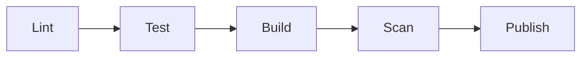
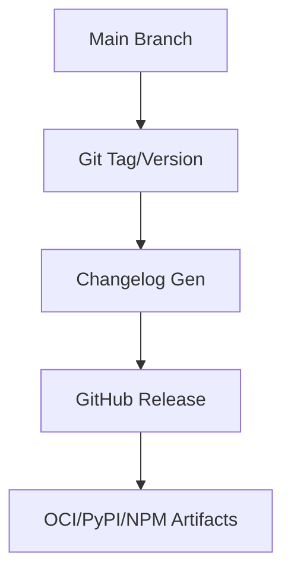

# Architecture Diagrams - learn-research-tools-starter

## Template Architecture

```mermaid
flowchart TD
  subgraph Apps
    UI[React SPA]
    API[FastAPI]
    W[Worker]
  end
  subgraph Data
    DB[(Postgres)]
    R[(Redis)]
  end
  subgraph OBS[Observability]
    P[Prometheus]
    G[Grafana]
  end
  UI <-> API
  API <-> DB
  API <-> R
  W <-> R
  W <-> DB
  Apps -.-> OBS
```

## CI Flow



## Release Workflow


